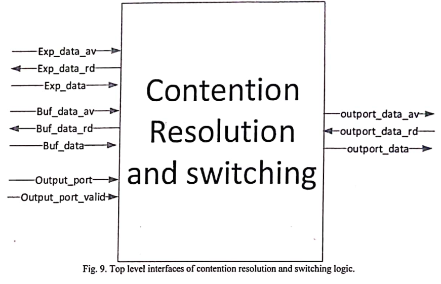

# Digital Logic Design Lab (CS 254, 2018-19 Spring, IIT Bombay)

Team name: DigiDestined

## Contention Resolution and Switching

**Contention Resolution and Switching** (CRS) is a part of a router developed at IIT Bombay. This project was implemented as a part of our course project in Digital Logic Design, and implements the said functionality using virtual output queues and arbiters. 

</img>

The module takes has two inputs for each port - one of which is a higher priority input. The incoming data is queued using the virtual output queues; the arbiters, then, runs round robin algorithm to connect (schedule) the virtual output queues to the appropriate output ports. The existence of virtual output queues avoids head of line blocking. The implementation has been found to be synthesizable in Xilinx ISE; however, no actual synthesis on FPGAs has been tried out using this specific github repository.

## Setting Up

Open a new project, in Xilinx ISE, and add all the `.vhd` files, except `tb_crs.vhd` and `tb_crs_144`, present in the directory [CRS-Digidestined](CRS-Digidestined) to the project. Add only one of `tb_crs.vhd` and `tb_crs_144.vhd` - the latter is for a full 144-bit vectors, and would likely require you to use a 4k or 8k screen to view the vectors completely! For the purposes of demonstration, therefore, use `tb_crs.vhd`.

Set `CRS.vhd` as the top module.

Also, generate `fifo` of the required size, and modify the required variables in global variables. 

The following global variables can be found in `globals.vhd`:

1. `N` - the number of input and output ports: there are N buffer input ports, N express input ports, and N output ports.
2. `dv_bit_interval` - if this is 4, then the 4th, 8th, 12th are the data valid bits.
3. `n_dv_bits` - if this is 3, then one data chunk contains 3 data valid bits.
4. `data_bus_size` - this is automatically initialised to the product of `dv_bit_interval` and `n_dv_bits`.

